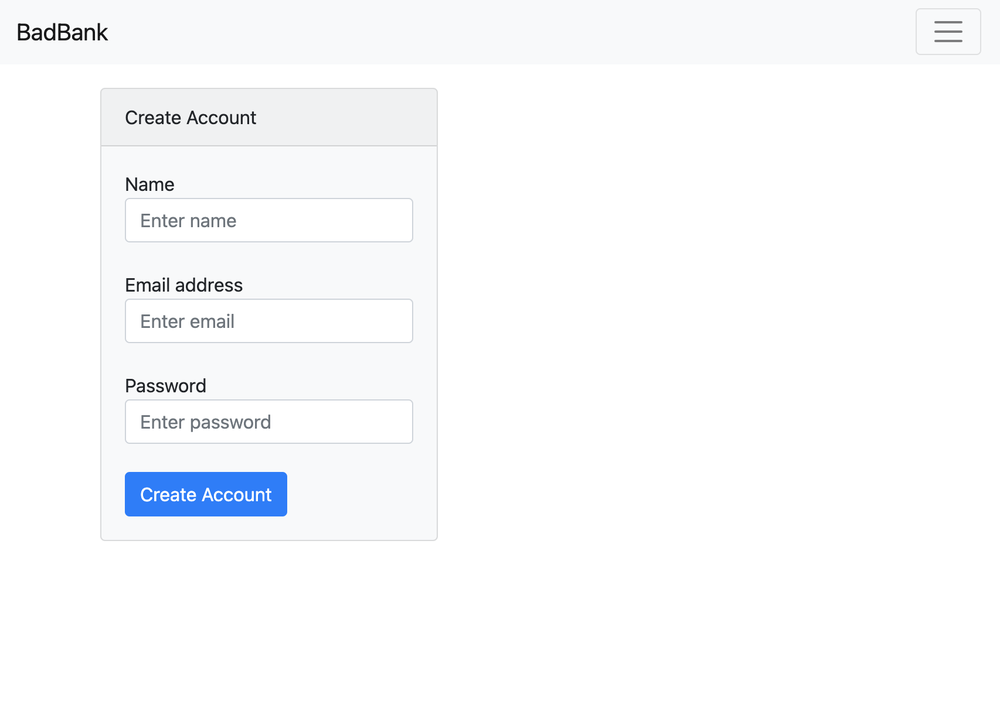

# Bad-Bank-Full-Stack-App

## Description

A full stack banking application created using the MERN stack. User are able to create accounts or login 
to deposit, withdraw, check balances, or even check all account balances, if giving admin permissions.  
This app was built for an assignment by MIT xPro, designed to improve my skills in building full stack applications. 

## Installation

1. Simply download the project folder to your local machine or fork the project.
2. Navigate to the root folder within the terminal.
3. Create a new docker container with mongoDB using <code>docker run -p 27017:27017 –name badbank -d mongo</code>
4. Run <code>npm install</code> and <code>node index.js</code>.
5. The project will then launch in your browser.
6. (Public URL will soon be uploaded).

## Stack

- MongoDB
- Express
- React
- Node
- Firebase

## Features

- One time sign in using firebase
- Admin access

## Future Improvements

Security will be enhanced by authenticating users with json web tokens.
UI style improvements will be made. 

## MIT License

Permission is hereby granted, free of charge, to any person obtaining a copy
of this software and associated documentation files (the "Software"), to deal
in the Software without restriction, including without limitation the rights
to use, copy, modify, merge, publish, distribute, sublicense, and/or sell
copies of the Software
